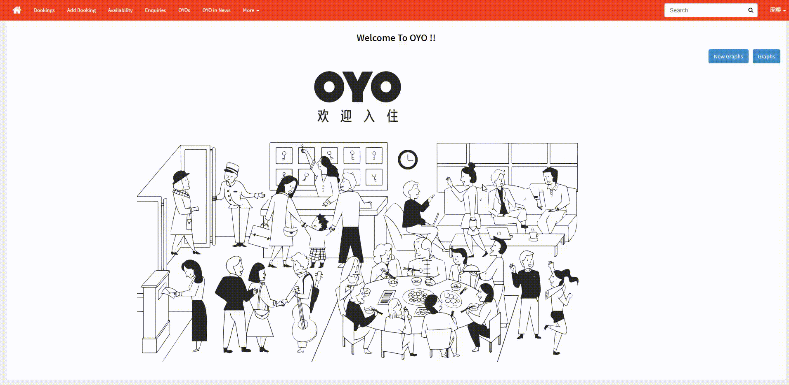
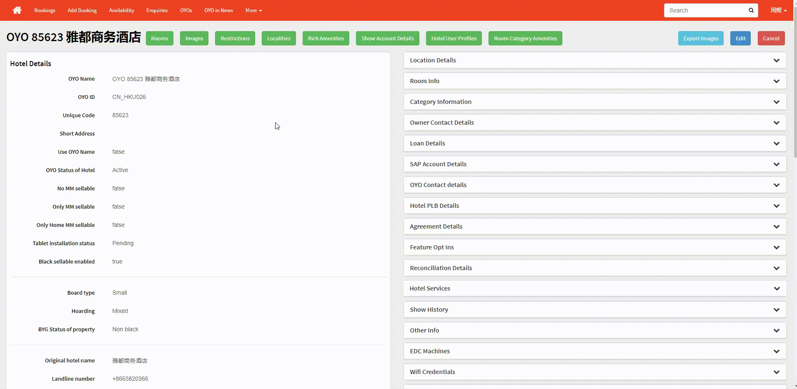
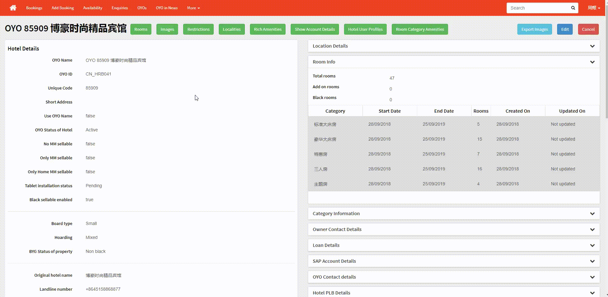
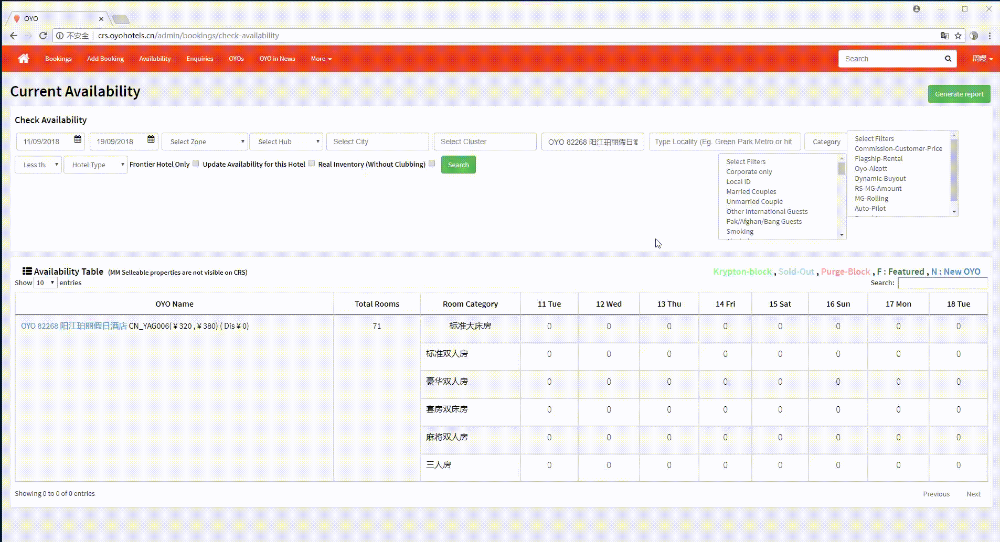

# 库存&新店上线相关问题

## 新酒店刚上线，你需要检查的事情有哪些？

### 酒店是否可以在CRS里被搜索到？

酒店可以使用PMS前，CRS一定已经可以被找到。

在CRS右上角的搜索框\(search\)中，输入酒店oyo id，如cn\_szx125，在下拉菜单中即可找到对应酒店。

如无法搜索到，可以通过CRS的城市列表来找到酒店。

具体方式如下：

  
找到酒店后，即可按照以下方式判断酒店设置是否完成。

### 酒店状态是否已经被激活？

收到运营卫士的PMS账号密码≠PMS已经可以登录。如酒店未被激活，PMS是无法登陆，也就无法查看库存。

如果通过CRS搜酒店的PMS账号（如cn\_szx125）无法搜到，该酒店就是未激活。

如已经可以搜到，而PMS仍然无法登陆，可以通过进入CRS的酒店详情页检查酒店状态。

  
Active酒店的特征：

* 详情页OYO Status of Hotel后为active
* 下拉看到 Multiple room category enabled后为true

### CRS权限是否已经完成设置？

如果酒店已经active了，PMS房态图无法显示，且首页显示如下图所示：

请检查酒店是否CRS权限完成设置，方法如下：

  

  
**如果没有看到标签，请邮件至&lt;techsupport@oyohotels.cn&gt;**催办理CRS的tag设置，标签出现后即可正常使用PMS。

### 酒店tags已经正常了，还是出现以上情况，怎么回事？

检查一下Rooms是否有同步，方法如下：

  
解决方式依旧是**邮件联系&lt;techsupport@oyohotels.cn&gt;**协助

### Active酒店，标签设置完善，仍然显示库存不足无法录入

这个方法适用于不点选 Real Inventory \(Without Clubbing\) 查看酒店库存，全部显示为0的情况。

注意，它并不解决以下问题：

* 酒店超售（实际录入库存大于酒店总房间数）
* orbis或氪系统判断为黑房，无法售卖

刷新方法的在线视频教程如下：



  
也可以参考以下动图：

### 新上线酒店房型和实际不一致怎么办？

PMS的房型信息是读取自CRS的Room Info的，查看Room Info的方式如下：

  
如CRS房型信息与签约不一致，请联系当地TR协助处理

## 已上线酒店，存在库存问题如何解决？

可以根据以下情况进行排除：

### 是否是前一日补录订单？

受限于印度系统每日0：00（印度时间，中国时间会在凌晨2：30）锁死逻辑的限制，虽然PMS开放了入住日次日12：00补录订单的功能，但补录订单数的上限仅限于0：00时可入住的最大房间数。

在入住日次日释放的库存不会还原到前一日。

例如A酒店，30间房，9/12的2：30前操作过5间钟点房离店，2：30在住25间房。则补录时最大可补录的房间数为5。补录的occ上限是35/30=117%

如有某一日occ超过100%的情况，请务必提示前台及时操作订单，减少补录。

如有酒店停电、断网等不可控原因导致无法正常录单，请按照收入泄露流程处理。

如不知道流程是什么，请邮件联系epicenter&lt;epicenter.china@oyorooms.com&gt;

### 是否存在OTA预抵订单未处理？是否存在当日应退房未及时操作？

PMS执行以下逻辑：

* 不支持超售，任何订单新建的时候都需要校验库存，库存不满足则无法建单
* OTA的订单在预抵状态就会占用酒店库存
* 在住订单只有在离店之后才会释放该房型的库存

所以如果存在OTA预抵订单占库存，或者当日应退房未及时处理，均会提示库存不足。

解决方案就是尽快准确处理订单，释放库存。

### 库存出现负值，订单无法录入

#### CRS存在两种库存计算方式。 

#### 一种是虚拟库存，是考虑房型升级的逻辑基础上的库存数。如标准大床房10间，行政大床房10间，标准大床房可以升级到行政房卖。在CRS上查看虚拟库存时，库存会显示标准大床房为20间。

#### 另一种是房型库存，房型库存是真实库存，是通过勾选 Real Inventory \(Without Clubbing\)后查看的。

  
库存出现负值多是因为虚拟库存的原因，让部分房型超售。

在此时如无法在对应房型创建新单，只需要及时处理离店即可。

**泰坦PMS暂时不支持预排房功能，故库存满只能将现有库存清除之后才能录单。**

### **可售卖的库存比酒店实际的库存要少**

查看酒店的可售卖房库存数据，可以通过查看CRS的RoomInfo实现，方法如下：

如酒店存在黑房，会体现在RoomInfo的Black Rooms里。

黑房有两种来源，一个是orbis系统，一个是氪系统。

如氪任务未完成，完成氪任务即可黑房变绿房在CRS里成为有效库存；

如氪任务完成或无氪任务，仍然有黑房，请联系TR团队协助检查PSA协议设置。

