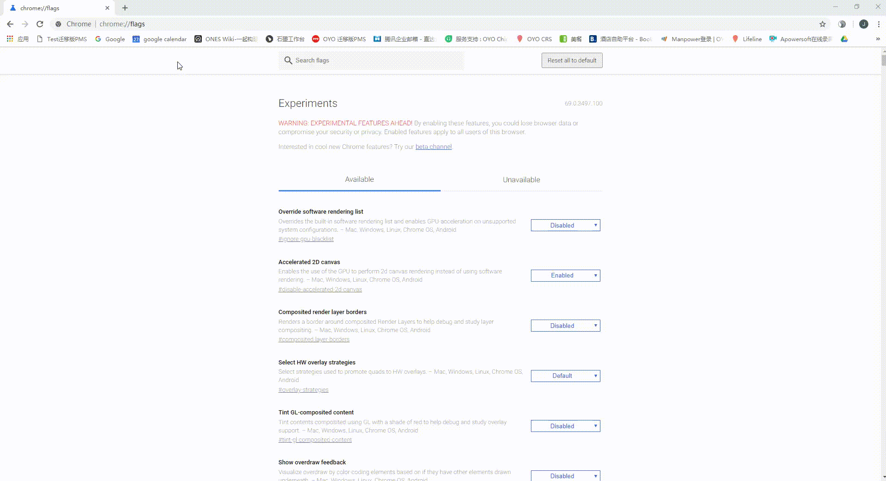

# 身份证读取功能使用前设置（施工中）


读卡器驱动下载


泰坦PMS身份证读取驱动，支持80%以上酒店原有设备读取身份证信息。

使用右侧链接可下载驱动：[https://cdn.oyohotels.cn/plugin/OYOidCard.msi](https://cdn.oyohotels.cn/plugin/OYOidCard.msi)


变更chrome的flag设置


如以下动画所示

在地址栏输入chorme://flag，回车

使用ctrl+f搜索“localhost”，选择对应的服务，将原有disable变成enable，变更后，点击"RELAUNCH NOW"重启浏览器。

