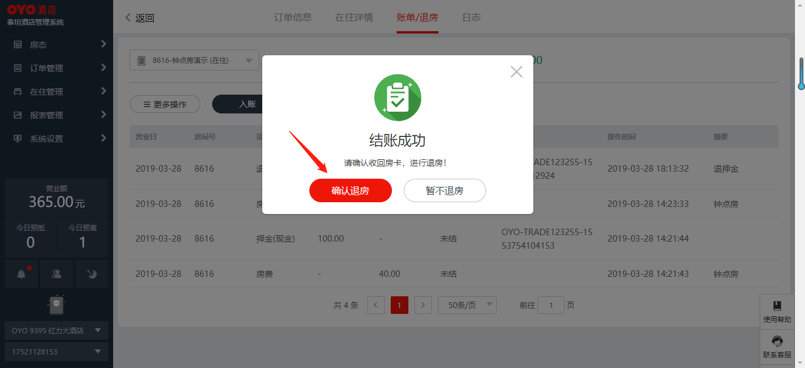

# 身份证读取功能

## 身份证读取功能使用前设置


使用chrome浏览器


xp用户下载：[点击此处下载](https://dl.google.com/release2/h8vnfiy7pvn3lxy9ehfsaxlrnnukgff8jnodrp0y21vrlem4x71lor5zzkliyh8fv3sryayu5uk5zi20ep7dwfnwr143dzxqijv/49.0.2623.112_chrome_installer.exe)

非xp用户下载：[点击此处下载](https://tools.shuax.com/chrome/#/)


读卡器驱动下载


泰坦PMS身份证读取驱动，支持80%以上酒店原有设备读取身份证信息。

使用右侧链接可下载驱动：[https://cdn.oyohotels.cn/plugin/OYOidCard.msi](https://cdn.oyohotels.cn/plugin/OYOidCard.msi)

**注意：泰坦2.0用户，请使用右侧链接下载：**



下载后，请安装在您的电脑中。身份证读取功能即可开始使用。


完成配置，在pms中读取客人身份证信息


在办理入住页面，点击读取证件启动身份证读卡器。

同一个房间可办理多个身份证读取，无需额外录入，只需要将不同的身份证放到身份证读卡器上，再次点击读取证件，即可生成一条新的入住人信息。


如驱动已安装，读卡器连接失败，系统会提示“正在连接身份证读卡器服务”和“未识别到身份证读卡器，请检查设备是否连接”


泰坦在**新建订单时会自动启用身份证读卡器功能**。如在此次启动时，未能自动读取，可点击“启动身份证读卡器”再启动一次。

读取成功，客人的身份证信息会自动出现在系统中。如该客人此前有住过oyo酒店，则ta的手机号会自动出现在系统里。  


泰坦1.3.7提供新的驱动安装包，安装后会在桌面自动建一个快捷方式，使用该快捷方式登录泰坦，无需设置localhost文件即可直接使用身份证读取功能


## 身份证读卡器申领

如酒店无身份证读卡器或读卡器无法适配，可申请身份证读卡器。

具体流程可参考下图：（点击可放大）

  
可点击以下链接下载机具阅读检测软件：（该软件仅做检测使用，使用完成后务必卸载）



