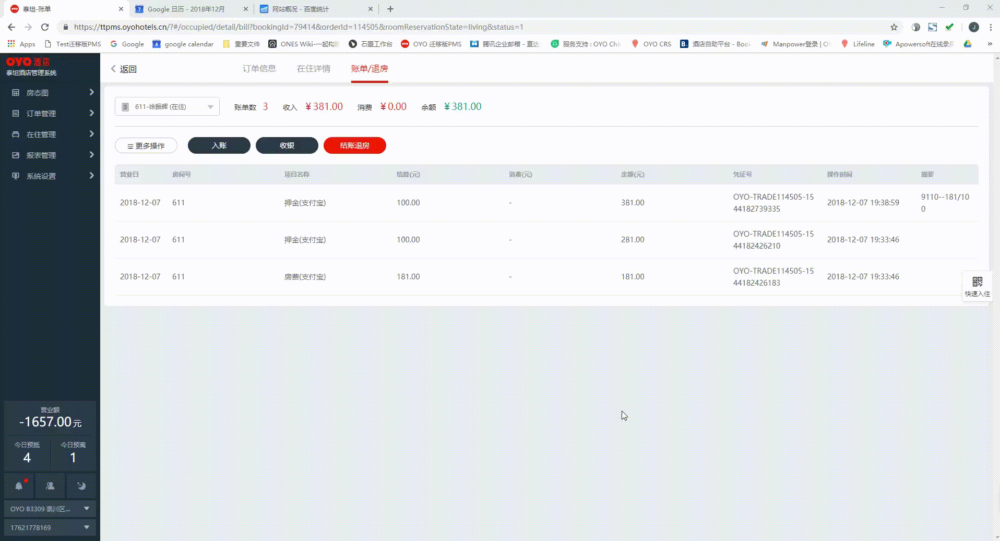

# 账目问题

## 前台误操作入住怎么办?

修改房费为0，操作离店。

后续会生成当日入离的报表，不计入当日occ

## 收银录错怎么办?

全额退款，之后重新收银。

* 注意：退款的时候请留意按原路径退款

## 为什么房费调整不能录入负数？

有两种可能：

* 未选择“其他”类别：先仅支持“其他”类别录入负数房费调整；
* 夜审前未产生应收：需要先生成房费，产生应收之后，才能调整房费；

