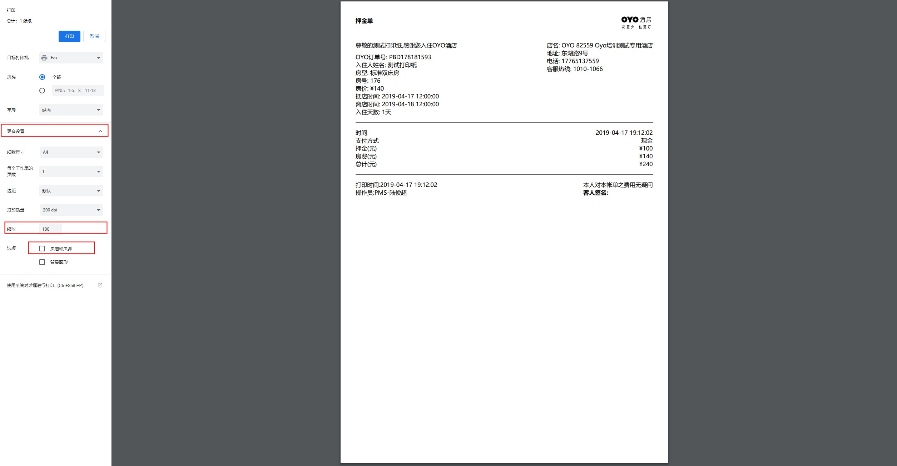

# 针式打印机配置教程

## 押金单打印

支持针式打印机纸张尺寸：241 mm\*279 mm \(二联或三联均可支持\)

* 在右下角选择 打印格式，选择针式打印机后，点击默认格式

* 勾选，确认入住自动打印单,点击确认入住

* 点击确认入住后，打印配置功能会自动打开

1. 点击更设置
2. 选择缩放比例推荐80~100
3. 取消页面和页脚 勾选后 即可打印

* 样式展示

1. 纸张尺寸：241 mm\*279 mm（二联三联均可支持）
2. 缩放比例100%
3. 打印机：针式打印机  

## 流水单、结算单打印

* 选择再住列表——账单/退房
* 选择更多操作——打印账务水单 

* 显示打印账单水流 项目名称

1. 勾选需要打印的项目
2. 选择打印格式
3. 选择后点击默认格式
4. 按确认键

* 确认按钮点击后，打印配置功能会自动打开

1. 根据项目列数选择缩放比例.（推荐80%）
2. 缩放比例80可打印3~5个项目明细，如房费、押金、其他消费类明细
3. 取消页面和页脚勾选
4. 点击打印即可

* 样式展示

1. 纸张尺寸：241 mm\*279 mm（二联三联均可支持）
2. 缩放比例100%
3. 打印机：针式打印机

