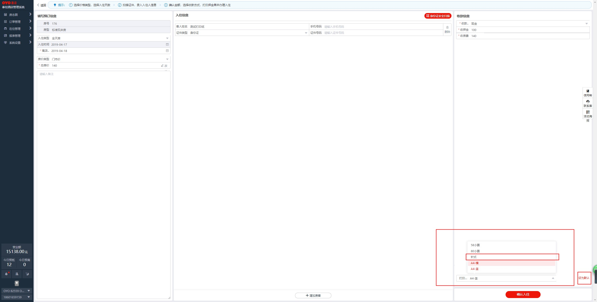
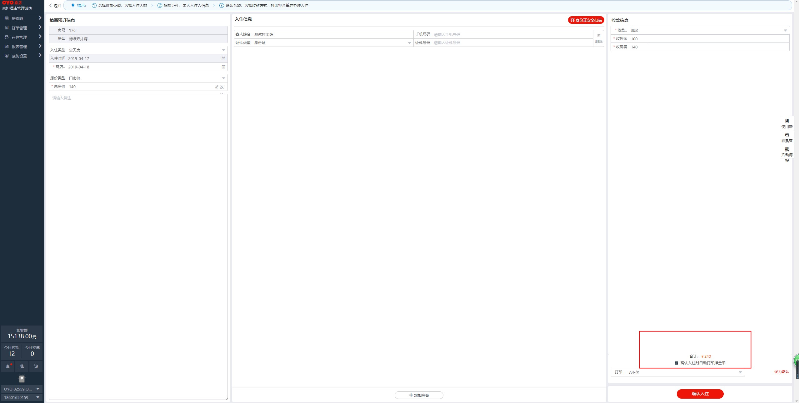
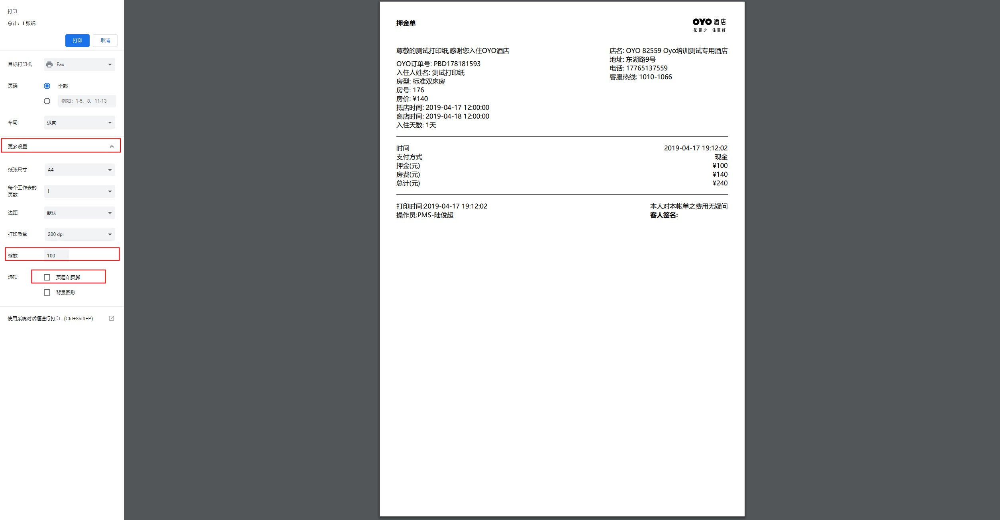

# 1.押金单打印配置教程

## 押金单打印

#### 支持针式打印机纸张尺寸：241 mm\*279 mm \(二联或三联均可支持\)

#### （1）在右下角选择 打印格式，选择针式打印机后，点击默认格式

#### \(2\)勾选，确认入住自动打印单,点击确认入住

#### （3） 点击确认入住后，打印配置功能会自动打开

1.点击更设置                                                                                                                           2选择缩放比例推荐80~100                                                                                                  3.取消页面和页脚 勾选                                                                                                       4.即可打印

#### （4）样式展示  

1.纸张尺寸：241 mm\*279 mm（二联三联均可支持）                                                                                                                           2.缩放比例100                                                                                                                                                                                                       3.打印机：针式打印机  

